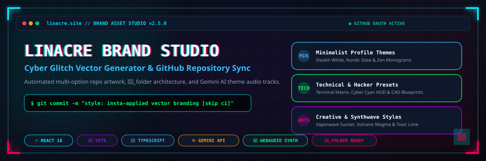

# Linacre Brand Asset Studio & GitHub Repo Sync

<p align="center">
  
</p>

<p align="center">
  <a href="#-profile-theme-categories"></a>
  <a href="#-github-repository-sync"></a>
  <a href="#-gemini-ai-integration"></a>
  <a href="#-art-folder-architecture-🎨_folder"></a>
</p>

---

## ⚡ Overview

**Linacre Brand Asset Studio & GitHub Repo Sync** is a full-stack developer workspace for creating high-frequency vector graphics, custom profile banners, vector logos, repository social cards, and WebAudio synth tracks.

It connects directly with **GitHub OAuth accounts** to automatically generate multi-option vector art tailored to project metadata (stars, languages, README excerpts, and topics), allowing developers to **Insta-Apply** updates directly to their open-source repositories.

---

## 🎨 Profile Theme Categories

The studio features **filtered theme presets** to help developers navigate profile designs and brand templates effortlessly:

### 1. 🤍 Minimalist Themes
* **Stealth-White**: Clean monochrome dark canvas with crisp white typography and ice-cyan accents.
* **Nordic-Slate**: Cool slate gray tones paired with frost blue highlights for sleek developer docs.
* **Zen-Vector**: High-contrast geometric line art and uncluttered negative space.
* **Clean-Architect**: Steel cyan underline accents with architectural typography.

### 2. 🟢 Technical & Hacker Themes
* **Cyber-Cyan**: Cyberpunk HUD elements with neon cyan (`#00F0FF`) and glitch crimson (`#FF0055`).
* **Matrix-Green**: Terminal CLI hacker aesthetic with green CRT scanline overlays and code brackets (`</>`).
* **Rust-Vault**: Zero-trust encrypted amber (`#F59E0B`) and vault security bronze for systems code.
* **Blueprint-CAD**: Industrial dark blue with CAD grid line overlays for engineering repositories.

### 3. 🟣 Creative & Synthwave Themes
* **Synth-Purple**: Vaporwave violet (`#B000FF`) & neon pink with retro 80s horizon aesthetics.
* **Volcanic-Red**: Magma flame crimson (`#FF0055`) & electric orange for gamedev projects.
* **Electric-Gold**: High-voltage yellow laser styling for gaming studios and asset packs.
* **Toxic-Lime**: Biohazard neon green & electric violet synth art.
* **Ultra-Blue**: Deep ocean cyber blue and quantum green gradients.

---

## 🚀 Key Features

### 1. 🔄 GitHub Repository Sync & Insta-Apply
* **Multi-Account OAuth**: Connect multiple GitHub profiles (`dlinacre`, `lin4cre`, `linacre.site`) or Personal Access Tokens (PAT).
* **Multi-Option AI Design Engine**: Instantly generates 4 contextually tailored vector variants for any selected asset type (Hero Banners, Logos, Icons, README Headers, Social OG Cards, and Badge Packs).
* **Insta-Apply Commits**: One-click GitHub synchronization that automatically pushes generated SVG assets directly into `.github/assets/` with automated commit hashes.

### 2. 🎧 Gemini AI Theme Audio Synthesizer
* **Procedural Soundscapes**: WebAudio Web-Synth node graph generating real-time theme audio loops.
* **Gemini Audio Generator**: Triggers Gemini API to generate custom Glitch-Tech theme audio tracks and WAV previews.

### 3. 🎨 Art Folder Architecture (`🎨_folder`)
Standardized directory structure for game developers and open-source project maintainers:

```text
🎨_folder/
├── 📂_raw/               # .blend, .psd, .ai, .fig editable assets
├── 📂_production/        # .fbx, .gltf, .png, .shader production builds
├── 📂_ui-ux/             # Vector icons, glitch HUDs, menus
├── 📂_audio/              # .wav, .mp3 SFX & synth loops
└── 📂_docs/               # Game Design Documents (GDD) & Style Guides
```

---

## 🛠️ Tech Stack & Architecture

| Layer | Technology |
| :--- | :--- |
| **Frontend** | React 18, Vite, TypeScript, Tailwind CSS, Lucide Icons |
| **Backend** | Express server (`server.ts`), bundled with `esbuild` for production |
| **AI Integration** | Google GenAI SDK (`@google/genai`) for Gemini 2.5 models |
| **Audio** | WebAudio API procedural synthesizer & HTML5 audio player |
| **Graphics** | Dynamic SVG shader generator, interactive scale/padding sliders |

---

## 💻 Getting Started

### Prerequisites
* Node.js v18+ 
* npm or bun

### Installation

1. **Clone the repository**:
   ```bash
   git clone https://github.com/dlinacre/linacre-brand-studio.git
   cd linacre-brand-studio
   ```

2. **Install dependencies**:
   ```bash
   npm install
   ```

3. **Configure Environment Variables**:
   Create a `.env` file (or copy from `.env.example`):
   ```env
   GEMINI_API_KEY=your_gemini_api_key_here
   ```

4. **Launch Development Server**:
   ```bash
   npm run dev
   ```
   Open `http://localhost:3000` in your browser.

5. **Build for Production**:
   ```bash
   npm run build
   npm start
   ```

---

<p align="center">
  <sub>Maintained by <b>D. Linacre</b> // Official Platform Domain: <a href="https://linacre.site">linacre.site</a></sub>
</p>
